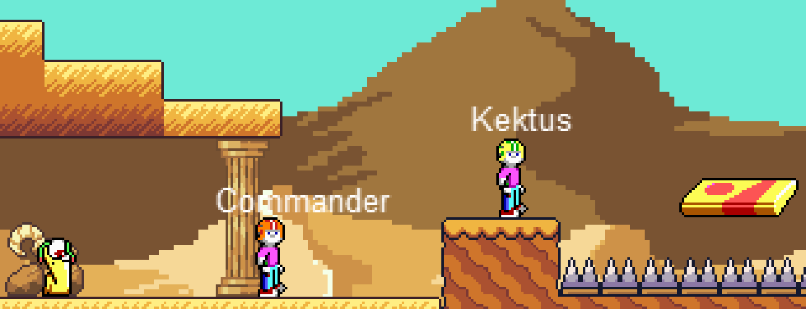

# Commander Kektus

## About
Commander Kektus ist ein Mini-Jump&Run und eine kleine Hommage an Commander Keen von id-Software (https://de.wikipedia.org/wiki/Commander_Keen), welches im Rahmen der Vorlesung "Webprogrammierung" an der DHBW Mannheim entsteht. Es bietet einen Single- und Multiplayer.



## Spielen
### Aktueller Build
http://18.192.24.53?mode=singleplayer&name=github

### Steuerung
- Links/Rechts: Cursor-Taste links/rechts
- Springen: Cursor-Taste hoch
- Schießen: Leertaste

## Technische Aspekte

Drei Unterprojekte...

### 1. Game

- Engine: melon.js (https://www.melonjs.org/)
- Netzwerk: websocket-API (https://developer.mozilla.org/en-US/docs/Web/API/WebSockets_API)
- Bundler: Parcel2 (https://v2.parceljs.org/)

Installation/Nutzung
```shell
git clone https://github.com/theweinzierl/commander-kektus && \
cd commander-kektus/game && \
npm install
```

Der lokale Server wird mit `npm run start` gestartet. Besser ist es aber, den https-Server zu verwenden: `npm run start-https`
Ein Build kann mit `npm run deploy` erstellt werden.

### 2. Frontend
Das Frontend liegt im Verzeichnis /frontend. Es wurde mit angular erstellt. Es wird ein Name abgefragt und zudem kann der Spielmodus (Single- oder Multiplayer) ausgewählt werden.

### 3. Multiplayer-Server

Der Multiplayer-Server erfüllt folgende Funktionen
- Anmeldung
- Spielvermittlung
- Datenaustausch

und setzt Deno und das websocket-Modul ein (https://deno.land/x/websocket@v0.1.1)

Installation/Nutzung

Wenn noch nicht geschehen: clone und cd nach /serverside/ . Dann:
```shell
deno run --allow-net --allow-read ./server.ts 
```

## Hosting
Der Game-Server läuft als ec2-Instanz bei aws und ist unter der IP 18.192.24.53 erreichbar. Auf Port 8080 lauscht der WebsocketServer. Auf Port 1234 läuft experimentell ein akuteller Build des Spiels.

ACHTUNG: Wir nutzen ein selbstsigniertes Zertifikat, weil manche Browser nur eine verschlüsselte Websocket-Verbindung zulassen. Unter Umständen müssen im Browser die Zertifikate unter
- https://18.192.24.53:8080
separat als Ausnahme hinzugefügt werden.
